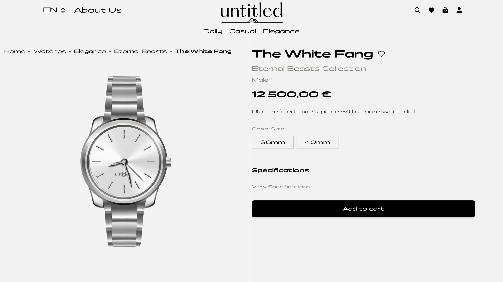
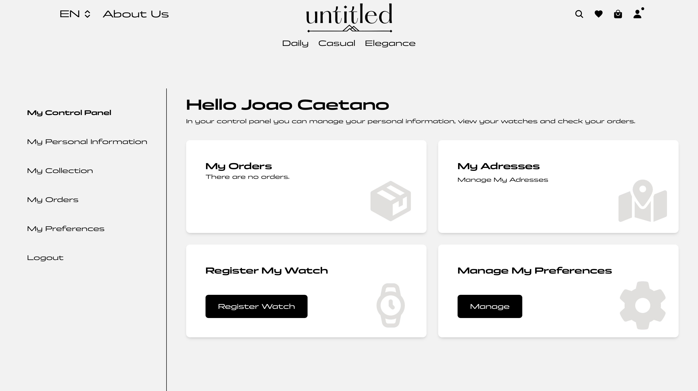

# Ecommerce Project 🛒

A full-stack ecommerce web application for a watch brand, where users can browse products, manage a shopping cart and wishlist, and complete purchases through a secure checkout flow.


## Features

- Product catalog with filtering by category, collection and gender
- Product page with size selection
- Shopping cart and wishlist
- Transactional checkout (delivery address, stock verification, server-side pricing)
- Authentication with signup, email verification by code, and password reset
- User profile with order history
- Admin panel for managing products, users and orders
- Multi-language support (EN, PT, ES, FR, DE)

## Tech Stack

- **Frontend:** React, React Router DOM, Tailwind CSS, i18next
- **Backend:** Node.js, Express, JWT, Zod, Nodemailer
- **Database:** MySQL
- **Security:** Helmet, rate limiting, restricted CORS, role-based authentication & authorization

## Running locally

### Prerequisites
- Node.js
- XAMPP (MySQL)
- A Gmail account with an [App Password](https://myaccount.google.com/apppasswords) (for sending verification / password-reset emails)

### Frontend
```bash
npm install
npm run dev
```

### Backend
```bash
cd api
npm install
npm run dev
```

### Database
Import `database/ecommerce_db.sql` in phpMyAdmin and configure `api/.env` based on `api/.env.example`.

The seed database ships with two demo accounts: `admin@demo.com` (admin) and `user@demo.com` (regular user).

### Environment variables (`api/.env`)
| Variable | Description |
|---|---|
| `API_URL` | Base API URL (e.g. `http://localhost:3001/api`) |
| `DB_HOST`, `DB_USER`, `DB_PASSWORD`, `DB_NAME` | MySQL connection |
| `JWT_SECRET` | Secret used to sign authentication tokens |
| `EMAIL_USER` | Gmail used to send verification / reset emails |
| `EMAIL_APP_PASSWORD` | Gmail App Password (not the account password) |
| `ALLOWED_ORIGINS` | Comma-separated list of origins allowed by CORS in production |

## Tests

The API has integration tests (Vitest + Supertest) focused on the most critical paths: authentication, authorization (owner vs. admin), and the transactional checkout (stock, pricing and SQL transaction). They run against the local database configured in `.env`, creating and cleaning up their own test data.

```bash
cd api
npm test
```

## Screenshots

**Home page**


**Product page**


**User dashboard**

